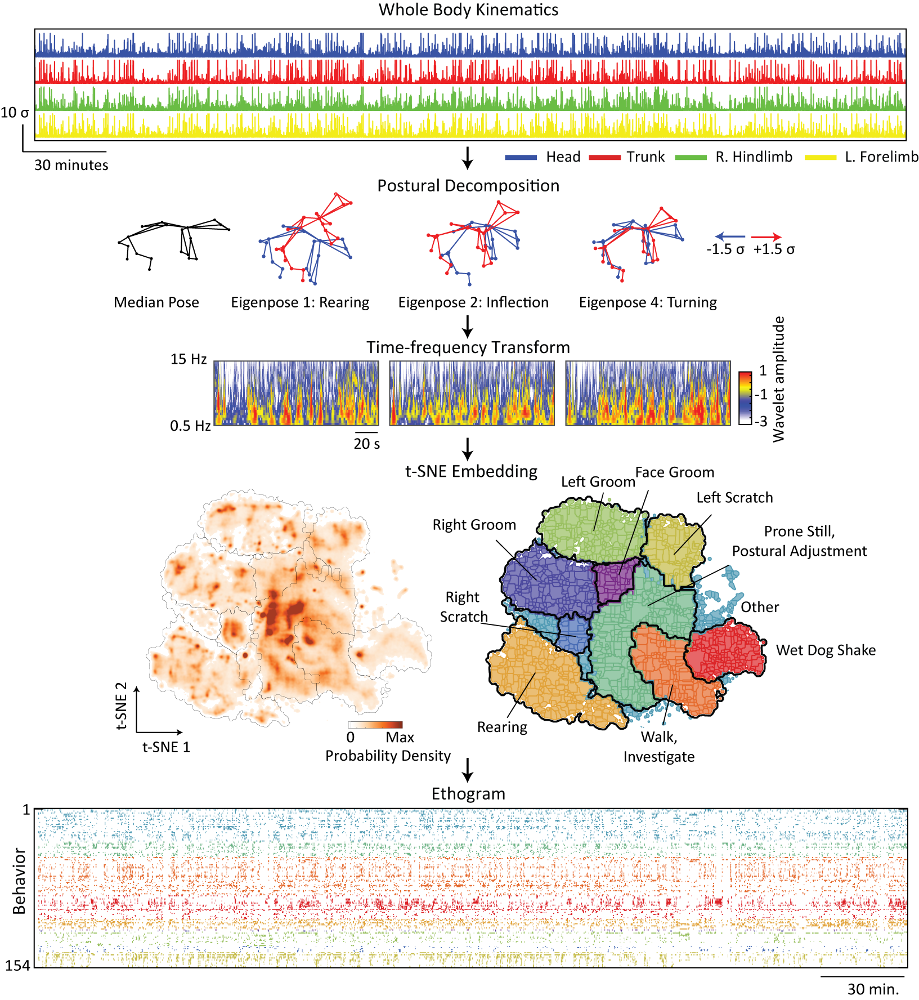

### Demo code for kinematic preprocessing and behavioral analysis
This is demo code for preprocessing raw 3D kinematic data collected using DANNCE or CAPTURE, and then performing behavioral segmentation using t-SNE and watershed clustering. It also includes scripts for visualizing kinematic data. 

The preprocessing script inputs raw 3D marker positions, smooths them using a simple median filter in each coordinate, and aligns them into an egocentric reference frame centered on the animal.

The behavioral analysis script generates a set of *behavioral features* based on (1) postural features, which are eigendecompositions of the animal's posture, body segment lengths, and joint angles and (2) dynamical features, which are the wavelet transform of these features.


Main demo files:
```
preprocessing/preprocess_dannce.m
CAPTURE_quickdemo.m
```


### Data Directories
You can download the DANNCE dataset and test CAPTURE dataset from:
- CAPTURE dataset: https://tinyurl.com/ycnn7cd6
- DANNCE dataset: https://tinyurl.com/y9dwkuwo

### This code uses functions from the following open source software:
The software is already included in the utilities folder. 
- Chronux: https://www.mathworks.com/matlabcentral/fileexchange/68537-chronux-analysis-software
- Pca_randomized: (old fex function)
- MTimesX: https://www.mathworks.com/matlabcentral/fileexchange/25977-mtimesx-fast-matrix-multiply-with-multi-dimensional-support
- Motionmapper: https://github.com/gordonberman/MotionMapper
- Structvars: https://www.mathworks.com/matlabcentral/fileexchange/26216-structure-fields-to-variables?focused=8211475&tab=function

**Compatibility**.
This code has been tested in 64-bit MATLAB 2017b and 2019b running on Windows 10.
